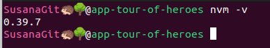

# Aplicación Tour of Heroes

| Descripción | 1r proyecto del curso “Desarrollo de aplicaciones híbridas para Android, iOS y PWA” |
| --- | --- |
| URL | https://angular.io/tutorial/tour-of-heroes |
| Etiquetas | #TypeScript #Angular |
| Fecha de inicio | 2024/05/07 |

# Instalaciones

## 1. Instalación de nvm en Ubuntu

- nvm es el acrónimo de "Node Version Manager" (Gestor de versiones de Node). Es una herramienta que te permite gestionar múltiples versiones de Node.js en tu sistema. Con nvm, puedes instalar varias versiones de Node.js y cambiar entre ellas fácilmente según tus necesidades.
- [https://github.com/nvm-sh/nvm](https://github.com/nvm-sh/nvm)

```bash
curl -o- https://raw.githubusercontent.com/nvm-sh/nvm/v0.39.7/install.sh | bash
```

- Ver la versión de nvm:

```bash
nvm -v
```



## 2. Instalación de la última versión de Node

- Node.js es un entorno de ejecución de código abierto, basado en el motor V8 de JavaScript de Google Chrome. Permite a los desarrolladores ejecutar código JavaScript en el lado del servidor, en lugar de solo en el navegador web. Esto significa que puedes crear aplicaciones de servidor utilizando JavaScript.
- Usaremos el nvm para instalar node.

```bash
nvm install --lts
```

## 3. Ver las versiones de node que tenemos instaladas

```bash
nvm ls
```


## 4. Usar la versión 20.12.2 de Node

```bash
nvm use 20.12.2
```


## 5. Instalación de la última versión de TypeScript

- Usaremos npm para instalar TypeScript.
- npm es el acrónimo de "Node Package Manager" (Administrador de Paquetes de Node). Es el administrador de paquetes predeterminado para Node.js, y se utiliza para instalar, compartir y gestionar dependencias de proyectos de Node.js.

```bash
npm install -g typescript
```

- Miro la versión que se ha instalado de TypeScript:

```bash
tsc -v
```


- Actualizo npm a una versión más reciente:

```bash
npm install -g npm@10.7.0
```

## 6. Instalación de Angular

- Usaremos npm para instalar Angular.

```bash
npm install -g @angular/cli
```


## 7. Comprovación de las instalaciones


# CONFIGURACIÓN GIT Y GITHUB

## 8. Configuro mi usuario y mail de Git

```bash
git config --global user.name "SusanaGit"
git config --global user.mail "169191115+SusanaGit@users.noreply.github.com"
```


## 9. Configurar Git para que utilice clave SSH en lugar de solicitar una contraseña cada vez que realizas una operación

- Voy al directorio ~/.ssh/:

```bash
cd ~/.ssh/
```

- Genero una nueva clave SSH:

```bash
ssh-keygen -t rsa -b 4096 -C "169191115+SusanaGit@users.noreply.github.com"
```

- Añado la clave pública SSH que acabo de generar en el GitHub.
- Añado la clave privada al directorio .ssh:

```bash
ssh-add ~/.ssh/id_rsa
```

- Pruebo la conexión SSH:

```bash
ssh -T git@github.com
```


- Modifico la configuración del archivo config que se encuentra en el directorio .ssh añadiéndole la clave privada que acabo de crear:


## 10. Creo un repositorio en Github llamado app-angular-tour-of-heroes


# DESARROLLO DE LA APP

## 11. Creación del proyecto app Tour of Heroes

- Voy a la carpeta donde quiero crear el proyecto.
- Me aseguro que el nombre y el mail del usuario de git sean los correctos:

```bash
git config --global user.name "SusanaGit"
git config --global user.email "169191115+SusanaGit@users.noreply.github.com"
```


- Creo el proyecto:

```bash
ng new angular-tour-of-heroes
```

- Selecciono Sass (SCSS)


- Le digo que NO quiero que active un Server-Side Rendering (SSR) ni un Static Site Generation (SSG/Prerending)


- Siempre es lo mismo: un proyecto con archivos y un paquete json con las librerías y sus dependencias.
- Hago un git log para asegurarme que el usuario SusanaGit haya hecho el primer commit:


- Yo solo pasaré a mis compañeros un proyecto con los archivos y ellos harán un nmp install para bajarse las mismas dependencias que tengo yo.
- Abro el proyecto con intellij.
- Me aseguro que el proyecto se haya creado correctamente:

```bash
ng build
```


- Lo que se ha generado en la carpeta dist es lo que pasaremos a producción, es lo que subo al servidor:


## 12. Subo el proyecto a GitHub

```bash
ssh -T git@github.com
```


## 13. Abrimos el navegador

```bash
ng serve --open
```


- Lo que estamos viendo es lo que se encuentra en el archivo VISTA app.component.html.


## 14. Análisis de los archivos que se encuentran en el directorio src.app

- app.component.html = VISTA
    - Vista con todos los elementos visuales y con lógica de vista, loops, ifs..
    - Plantilla del componente, escrita en HTML.
    - Solo es un armazón.
    - Se encarga de mostrar los datos del controlador app.component.ts.
- app.component.scss = estilos
    - Estilos que se aplican a la VISTA.
    - El CSS del componente.
- app.component.ts = CONTROLADOR
    - Lógica que se aplica.
    - La classe que contiene el código del componente, escrita en TypeScript.
    - Trabaja con los datos que se mostrarán.
- Nos encontramos ante un modelo vista controlador.
- El MODELO se encuentra en la carpeta node_modules.
- El archivo app.component.spec.ts lo he eliminado porque no lo usaremos en esta aplicación.

## 15. Cambiamos el título de la aplicación

- Añado a la propiedad title del controlador app.component.ts el valor ‘Tour of Heroes’:

```tsx
// TypeScript
// CONTROLADOR app.component.ts
import { Component } from '@angular/core';
import { RouterOutlet } from '@angular/router';

@Component({
  selector: 'app-root',
  standalone: true,
  imports: [RouterOutlet],
  templateUrl: './app.component.html',
  styleUrl: './app.component.scss'
})
export class AppComponent {
  title = 'Tour of Heroes';
}
```


## 16. La vista app.component.html muestra el título

- Sustituyo todo lo que hay en la vista app.component.html por:

```html
<!-- HTML -->
<!-- VISTA app.component.html-->
<h1>{{title}}</h1>
```

- Ponemos esto {{ para mostrar el contenido de la propiedad del controlador title en la vista. Sea cual sea el valor de title, la vista renderizará el valor. Se puede cambiar en tiempo real.


## 17. Añado estilos globales a la aplicación

```scss
// Scss
// ESTILOS src/styles.scss

/* Application-wide Styles */
h1 {
  color: #369;  font-family: Arial, Helvetica, sans-serif;  font-size: 250%;}
h2, h3 {
  color: #444;  font-family: Arial, Helvetica, sans-serif;  font-weight: lighter;}
body {
  margin: 2em;}
body, input[type="text"], button {
  color: #333;  font-family: Cambria, Georgia, serif;}
button {
  background-color: #eee;  border: none;  border-radius: 4px;  cursor: pointer;  color: black;  font-size: 1.2rem;  padding: 1rem;  margin-right: 1rem;  margin-bottom: 1rem;  margin-top: 1rem;}
button:hover {
  background-color: black;  color: white;}
button:disabled {
  background-color: #eee;  color: #aaa;  cursor: auto;}
/* everywhere else */
* {
  font-family: Arial, Helvetica, sans-serif;
}
```


## 18. ¿Qué diferencia hay entre el archivo app.component.scss y el archivo styles.scss?

- El app.component.scss son los estilos que se aplican única y exclusivamente a la vista app.component.html.
- El styles.scss son los estilos que se aplican a todos los componentes. Luego cada componente puede tener su propio scss.

## 19. ¿Qué es una arquitectura hecha en componentes?

- El componente app.component.html es el componente padre, y el resto de la aplicación son otros componentes. Una página es un componente, un listado es un componente, etc.. La aplicación son componentes que se van anidando.

## 20. Creamos el componente heroes

```bash
# Bash

ng generate component heroes
```


## 21. Analizo las propiedades del componente

- selector:
    - The component’s CSS element selector.
    - Esta propiedad define el nombre del selector de CSS que se utilizará en el HTML para representar este componente. Cuando se define un componente, el selector especifica cómo se invocará este componente dentro de un template de Angular. Por ejemplo, si configuras **`selector: 'app-my-component'`**, puedes usar **`<app-my-component></app-my-component>`** en tu HTML para añadir este componente.
- standalone:
    - Introducido en Angular 14, el flag **`standalone`** permite definir un componente que no depende de un módulo externo para funcionar. Esto es parte de una nueva característica que permite más modularidad y reusabilidad, permitiendo a los componentes ser más autónomos. Cuando se establece **`standalone: true`**, el componente puede ser importado directamente en otros componentes sin necesidad de declararlo en un módulo de Angular. Esto simplifica la estructura de la aplicación y mejora la capacidad de mantenimiento.
- imports:
    - Esta propiedad es utilizada junto con **`standalone: true`**. Permite especificar qué otros módulos o componentes standalone son necesarios para el componente actual. Esencialmente, define las dependencias que el componente necesita para funcionar correctamente. Proporciona una forma de incluir directamente las dependencias requeridas por el componente, facilitando una estructura más clara y modularizada de la aplicación.
- templateUrl:
    - The location of the component’s template file.
    - Define la ubicación del archivo de plantilla HTML del componente. Este archivo contiene el marcado HTML que representa la vista del componente.
- styleUrl:
    - The location of the component’s private CSS styles.
    - Especifica la ubicación de los archivos de estilo CSS específicos para el componente. Estos estilos son aplicados solo al componente y no afectan a otros elementos fuera del componente.

## 22. Añadimos la propiedad hero al controlador heroes.component.ts

```tsx
// TypeScript
// CONTROLADOR heroes.component.ts

import { Component } from '@angular/core';

@Component({
  selector: 'app-heroes',
  standalone: true,
  imports: [],
  templateUrl: './heroes.component.html',
  styleUrl: './heroes.component.scss'
})
export class HeroesComponent {
  hero ='Windstorm';
}
```

## 23. Mostramos al hero en la vista heroes.component.html

```html
// HTML
// VISTA heroes.component.html

<h2>{{hero}}</h2>
```

- {{hero}} renderiza el contenido de hero de heroes.component.ts

## 24. Mostramos la vista heroes.component.html

- Para ver el contenido de HeroesComponent tengo que decir dónde se va a ver. Tengo que decir qué componente lo va a contener, quién va a ser el padre.
- Para hacer que un componente se vea en otro componente, voy a hacer un ejemplo. Voy al archivo heroes.component.ts. El @Component es la notación que encima de la clase indica que la clase se va a comportar como un componente angular. Es una notación propia de angular.
- En la notación @Component podemos ver:
    - templateUrl: → qué vista se asocia a este component
    - styleUrl: → qué estilos se asocian a este component
    - selector: → donde quiera que este selector se muestre, se mostrará el contenido de este componente
- Añado el valor del selector de HeroesComponent en la vista app.component.html para que se vea ese valor del componente:

```html
// HTML
// VISTA app.component.html

<h1>{{title}}</h1>

<!-- Muestro el contenido del componente heroes.component.ts-->
<app-heroes></app-heroes>
```

- Tendré que importar la clase heroes.component en la clase controlador app.component.ts para que se pueda leer el selector app-heroes de la clase heroes.component.ts:

```tsx
// TypeScript
// CONTROLADOR app.component.ts

import { Component } from '@angular/core';
import { RouterOutlet } from '@angular/router';
import {HeroesComponent} from "./heroes/heroes.component";

@Component({
  selector: 'app-root',
  standalone: true,
  imports: [RouterOutlet, HeroesComponent],
  templateUrl: './app.component.html',
  styleUrl: './app.component.scss'
})
export class AppComponent {
  title = 'Tour of Heroes';
}
```


## 25. ¿Qué significa usar una estructura standalone?

- Cada componente es como un módulo, y tengo que importar dentro de cada componente todos los componentes que se van a usar.
- Si quiero usar el componente HeroesComponent dentro de AppComponent tendré que importar HeroesComponent dentro de app.component.ts.

## 26. Creo una interfaz Hero

- Creo un directorio llamado model dentro del directorio app. Dentro de la carpeta model van a ir todos los objetos.
- Creo un objeto llamado interfaces.ts


```tsx
// TypeScript
// model/interfaces.ts

export interface Hero {

    id: number;
    name: string;

}
```

- Como queremos usar model/interfaces.ts en HeroesComponent, vamos al controlador heroes.component.ts y la importamos:

```tsx
// TypeScript
// CONTROLADOR heroes.component.ts

import { Component } from '@angular/core';
import { Hero } from '../model/interfaces';

@Component({
  selector: 'app-heroes',
  standalone: true,
  imports: [],
  templateUrl: './heroes.component.html',
  styleUrl: './heroes.component.scss'
})
export class HeroesComponent {
  hero ='Windstorm';
}
```

## 27. Refactorizamos el hero de HeroesComponent

- Refactorizamos el hero del componente HeroesComponent para que sea de tipo Hero.
- Inicializamos Hero con un id = 1 y con el name = “Windstorm”.

```tsx
// TypeScript
// CONTROLADOR heroes.component.ts

import { Component } from '@angular/core';
import { Hero } from '../model/interfaces';

@Component({
  selector: 'app-heroes',
  standalone: true,
  imports: [],
  templateUrl: './heroes.component.html',
  styleUrl: './heroes.component.scss'
})

export class HeroesComponent {
  hero: Hero = {
    id: 1,
    name: 'Windstorm'
  };
}
```


## 28. Muestra el objeto hero

- Para ello vamos a la clase vista heroes.component.html y hacemos que se vea el nombre del objeto hero y sus atributos.
- El nombre del objeto como título <h2> lo queremos en mayúscula:

```html
// HTML
// VISTA heroes.component.html

<h2>{{hero.name | uppercase}} Details</h2>

<!-- hago que se muestren los atributos del objeto hero -->
<div><span>id: </span>{{hero.id}}</div>
<div><span>name: </span>{{hero.name}}</div>
```

- Tenemos que importar uppercase en heroes.component.ts:

```tsx
// TypeScript
// CONTROLADOR heroes.component.ts

import { Component } from '@angular/core';
import { Hero } from '../model/interfaces';
import {UpperCasePipe} from "@angular/common";

@Component({
  selector: 'app-heroes',
  standalone: true,
  imports: [
    UpperCasePipe
  ],
  templateUrl: './heroes.component.html',
  styleUrl: './heroes.component.scss'
})

export class HeroesComponent {
  hero: Hero = {
    id: 1,
    name: 'Windstorm'
  };
}
```


## 29. ¿Qué son los pipe?

- Los pipes en Angular permiten transformar datos directamente en las plantillas antes de que se muestren.
- Son una forma de aplicar transformaciones comunes a los datos como podrían ser formatos de fechas, transformaciones de cadenas de texto, cambios de moneda, y más, sin necesidad de modificar la lógica de negocio del componente.

## 30. Two-way binding

- Queremos hacer que si el usuario cambia el valor en la vista (heroes.component.html), cambie el valor en el controlador (heroes.component.ts).
- Refactorizamos los detalles del área de la vista de HeroesComponent añadiéndole el label y ngModel:

```html
// HTML
// VISTA heroes.component.html

<div>
	<label for="name">Hero name: </label>
	<input id="name" [(ngModel)]="hero.name" placeholder="name">
</div>
```

- Importo FormsModule en el controlador heroes.component.ts:

```tsx
// TypeScript
// CONTROLADOR heroes.component.ts

import { Component } from '@angular/core';
import { Hero } from '../model/interfaces';
import {UpperCasePipe} from "@angular/common";
import {FormsModule} from "@angular/forms";

@Component({
  selector: 'app-heroes',
  standalone: true,
  imports: [
    UpperCasePipe,
    FormsModule
  ],
  templateUrl: './heroes.component.html',
  styleUrl: './heroes.component.scss'
})
export class HeroesComponent {

  hero: Hero = {
    id: 1,
    name: 'Windstorm'
  };

}
```


## 31. Creamos un listado de heroes

- Creamos un directorio app/services.
- Dentro del nuevo directorio creamos un archivo heroes.service.ts
- Añado el listado de heroes:

```tsx
// TypeScript
// heroes.service.ts

import {Hero} from "../model/interfaces";

export const HEROES: Hero[] = [
  { id: 12, name: 'Dr. Nice' },
  { id: 13, name: 'Bombasto' },
  { id: 14, name: 'Celeritas' },
  { id: 15, name: 'Magneta' },
  { id: 16, name: 'RubberMan' },
  { id: 17, name: 'Dynama' },
  { id: 18, name: 'Dr. IQ' },
  { id: 19, name: 'Magma' },
  { id: 20, name: 'Tornado' }
];
```

## 32. Añadimos el listado de heroes a heroes.component.ts

- Ahora el hero de heroes.component.ts ya no será un único heroe sino que será un listado de heroes.
- Para poder usar la constante HEROES de heroes.service.ts en el controlador heroes.component.ts necesitaremos importarla:

```tsx
// TypeScript
// heroes.component.ts

import { Component } from '@angular/core';
import { Hero } from '../model/interfaces';
import {UpperCasePipe} from "@angular/common";
import {FormsModule} from "@angular/forms";
import {HEROES} from "../services/heroes.service";

@Component({
  selector: 'app-heroes',
  standalone: true,
  imports: [
    UpperCasePipe,
    FormsModule
  ],
  templateUrl: './heroes.component.html',
  styleUrl: './heroes.component.scss'
})
export class HeroesComponent {

  heroes = HEROES;

}
```

## 33. Importamos NgFor en el controlador heroes.component.ts

- Para poder visualizar los distintos heroes de dentro del listado de heroes, importaremos primero NgFor en el controlador heroes.component.ts

```tsx
// TypeScript
// heroes.component.ts

import { Component } from '@angular/core';
import { Hero } from '../model/interfaces';
import {NgFor, UpperCasePipe} from "@angular/common";
import {FormsModule} from "@angular/forms";
import {HEROES} from "../services/heroes.service";

@Component({
  selector: 'app-heroes',
  standalone: true,
  imports: [
    UpperCasePipe,
    FormsModule,
    NgFor
  ],
  templateUrl: './heroes.component.html',
  styleUrl: './heroes.component.scss'
})
export class HeroesComponent {

  heroes = HEROES;

}
```

## 34. Creamos el for en la vista heroes.component.html

- Por cada hero en heroes, príntame sus datos.
- Es muy importante poner * delante de ngFor.

```html
// HTML
// heroes.component.html

<h2>My Heroes</h2>
<ul class="heroes">
    <li *ngFor="let hero of heroes">
            <button type="button">
            <span class="badge">{{hero.id}}</span>
            <span class="name">{{hero.name}}</span>
        </button>
    </li>
</ul>
```


## 35. Añado los estilos a heroes.component.scss

```scss
// Scss
// heroes.component.css

/* HeroesComponent's private CSS styles */
.heroes {
  margin: 0 0 2em 0;
  list-style-type: none;
  padding: 0;
  width: 15em;
}

.heroes li {
  display: flex;
}

.heroes button {
  flex: 1;
  cursor: pointer;
  position: relative;
  left: 0;
  background-color: #EEE;
  margin: .5em;
  padding: 0;
  border-radius: 4px;
  display: flex;
  align-items: stretch;
  height: 1.8em;
}

.heroes button:hover {
  color: #2c3a41;
  background-color: #e6e6e6;
  left: .1em;
}

.heroes button:active {
  background-color: #525252;
  color: #fafafa;
}

.heroes button.selected {
  background-color: black;
  color: white;
}

.heroes button.selected:hover {
  background-color: #505050;
  color: white;
}

.heroes button.selected:active {
  background-color: black;
  color: white;
}

.heroes .badge {
  display: inline-block;
  font-size: small;
  color: white;
  padding: 0.8em 0.7em 0 0.7em;
  background-color: #405061;
  line-height: 1em;
  margin-right: .8em;
  border-radius: 4px 0 0 4px;
}

.heroes .name {
  align-self: center;
}
```


## 36. Añadimos un click event binding

- Cuando el usuario clique en el button, Angular ejecutará la función onSelect(hero).

```html
<!-- HTML -->
<!-- VISTA heroes.component.html -->
<h2>My Heroes</h2>
<ul class="heroes">
    <li *ngFor="let hero of heroes">
            <button type="button" (click)="onSelect(hero)">
            <span class="badge">{{hero.id}}</span>
            <span class="name">{{hero.name}}</span>
        </button>
    </li>
</ul>
```

- Tenemos que crear la función onSelect(hero) en heroes.component.ts.
- Para mirar que funciona, creamos un console.log dentro del método. Cada vez que cliquemos a un hero en la consola veremos test y su nombre:

```tsx
// TypeScript
// CONTROLADOR heroes.component.ts

import { Component } from '@angular/core';
import { Hero } from '../model/interfaces';
import {NgFor, UpperCasePipe} from "@angular/common";
import {FormsModule} from "@angular/forms";
import {HEROES} from "../services/heroes.service";

@Component({
  selector: 'app-heroes',
  standalone: true,
  imports: [
    UpperCasePipe,
    FormsModule,
    NgFor
  ],
  templateUrl: './heroes.component.html',
  styleUrl: './heroes.component.scss'
})
export class HeroesComponent {

  heroes = HEROES;

  onSelect(hero: Hero) {
    console.log('test', hero.name);
  }
}
```


## 37. Visualizar la información de cada hero seleccionado

- Arreglo el código del método onSelect(hero):

```tsx
// TypeScript
// CONTROLADOR heroes.component.ts

import { Component } from '@angular/core';
import { Hero } from '../model/interfaces';
import {NgFor, UpperCasePipe} from "@angular/common";
import {FormsModule} from "@angular/forms";
import {HEROES} from "../services/heroes.service";

@Component({
  selector: 'app-heroes',
  standalone: true,
  imports: [
    UpperCasePipe,
    FormsModule,
    NgFor
  ],
  templateUrl: './heroes.component.html',
  styleUrl: './heroes.component.scss'
})
export class HeroesComponent {

	heroes = HEROES;

  selectedHero?: Hero;
  onSelect(hero: Hero): void {
    this.selectedHero = hero;
  }
}
```

- Modifico el código de la vista heroes.component.html para poder ver correctamente la información de cada hero seleccionado.
- Muy importante no olvidarse del * delante de ngIf.

```html
<!-- HTML -->
<!-- VISTA heroes.component.html --> 
<h2>My Heroes</h2>
<ul class="heroes">
    <li *ngFor="let hero of heroes">
            <button type="button" (click)="onSelect(hero)">
            <span class="badge">{{hero.id}}</span>
            <span class="name">{{hero.name}}</span>
        </button>
    </li>
</ul>

<div *ngIf="selectedHero">
    <h2>{{selectedHero.name | uppercase}} Details</h2>
    <div>id: {{selectedHero.id}}</div>
    <div>
        <label for="hero-name">Hero name: </label>
        <input id="hero-name" [(ngModel)]="selectedHero.name" placeholder="name">
    </div>
</div>
```

## 38. Añado estilos para el hero seleccionado

- Para ayudarnos a identificar el hero seleccionado, podemos usar class.selected en el button.
- Añadimos [class.selected] al button de la vista heroes.component.html.

```html
<!-- HTML -->
<!-- VISTA heroes.component.html -->
<h2>My Heroes</h2>
<ul class="heroes">
    <li *ngFor="let hero of heroes">
        <button [class.selected]="hero === selectedHero" type="button" (click)="onSelect(hero)">
            <span class="badge">{{hero.id}}</span>
            <span class="name">{{hero.name}}</span>
        </button>
    </li>
</ul>

<div *ngIf="selectedHero">
    <h2>{{selectedHero.name | uppercase}} Details</h2>
    <div>id: {{selectedHero.id}}</div>
    <div>
        <label for="hero-name">Hero name: </label>
        <input id="hero-name" [(ngModel)]="selectedHero.name" placeholder="name">
    </div>
</div>
```

- Ahora el hero seleccionado queda marcado de azul oscuro cuando clicamos encima:


## 39. Genero un nuevo componente llamado hero-detail

- Hasta el momento, HeroesComponent muestra dos listas: el listado de heroes y el listado de las características del heroe seleccionado.
- Ahora quiero separar las características del heroe seleccionado, para que el código sea más reusable. Las características del heroe ahora estarán en HeroDetailComponent.
- Para ello, genero un nuevo componente hero-detail:

```bash
ng generate component hero-detail
```


## 40. Añado el código correspondiente a los detalles del hero en Hero-DetailComponent

- Para poder visualizar en la vista hero-detail.component.html los detalles del hero, enganchamos el código que le corresponde de heroes.component.html y cambiamos todos los selectedHero a hero:

```html
<!-- HTML -->
<!-- VISTA hero-detail.component.html -->
<div *ngIf="hero">
  <h2>{{hero.name | uppercase}} Details</h2>
  <div><span>id: </span>{{hero.id}}</div>
  <div>
    <label for="hero-name">Hero name: </label>
    <input id="hero-name" [(ngModel)]="selectedHero.name" placeholder="name">
  </div>
</div>
```

- Como queremos usar Hero en la clase Hero-detailComponent tendremos que importarla en el controlador hero-detail.component.ts.
- La propiedad debe ser una propiedad Input, anotada con @Input().
- Importamos también el Input de @angular/core.
- **`@Input()`** es un decorador en Angular que se utiliza para marcar una propiedad de una clase de componente como una propiedad de entrada. Esto significa que la propiedad puede ser asignada desde un componente padre al componente hijo a través de la plantilla del componente hijo.
- En el contexto de tu código, la propiedad **`hero`** en la clase **`HeroDetailComponent`** está marcada con **`@Input()`**, lo que significa que esta propiedad puede ser asignada desde el componente padre al componente **`HeroDetailComponent`**. Esto te permite pasar un objeto **`Hero`** desde el componente padre al componente hijo **`HeroDetailComponent`**.

```tsx
// TypeScript
// CONTROLADOR hero-detail.component.ts
import {Component, Input} from '@angular/core';
import {FormsModule} from "@angular/forms";
import {NgIf, UpperCasePipe} from "@angular/common";
import { Hero } from '../model/interfaces';

@Component({
  selector: 'app-hero-detail',
  standalone: true,
    imports: [
        FormsModule,
        NgIf,
        UpperCasePipe
    ],
  templateUrl: './hero-detail.component.html',
  styleUrl: './hero-detail.component.scss'
})
export class HeroDetailComponent {
  @Input() hero?: Hero;
}
```

## 41. Actualizo la vista de HeroesComponent

- Añado a la vista heroes.component.html el selector de la clase Hero-DetailComponent (app-hero-detail) para que se visualice Hero-DetailComponent:

```html
// TypeScript
// VISTA heroes.component.html
<h2>My Heroes</h2>
<ul class="heroes">
    <li *ngFor="let hero of heroes">
        <button [class.selected]="hero === selectedHero" type="button" (click)="onSelect(hero)">
            <span class="badge">{{hero.id}}</span>
            <span class="name">{{hero.name}}</span>
        </button>
    </li>
</ul>

<app-hero-detail [hero]="selectedHero"></app-hero-detail>
```

- Como quiero usar la clase Hero-DetailComponent en HeroesComponent, necesito importar la clase Hero-DetailComponent en heroes.component.ts:

```tsx
// TypeScript
// CONTROLADOR heroes.component.ts
import { Component } from '@angular/core';
import { Hero } from '../model/interfaces';
import {NgFor, NgIf, UpperCasePipe} from "@angular/common";
import {FormsModule} from "@angular/forms";
import {HEROES} from "../services/heroes.service";
import {HeroDetailComponent} from "../hero-detail/hero-detail.component";

@Component({
  selector: 'app-heroes',
  standalone: true,
  imports: [
    UpperCasePipe,
    FormsModule,
    NgFor,
    NgIf,
    HeroDetailComponent
  ],
  templateUrl: './heroes.component.html',
  styleUrl: './heroes.component.scss'
})
export class HeroesComponent {

  heroes = HEROES;

  selectedHero?: Hero;
  onSelect(hero: Hero): void {
    this.selectedHero = hero;
  }
}
```

## 42. Creamos un servicio llamado hero

- Los componentes no deberían guardar datos directamente, solo deberían focalizarse en presentar datos y delegar datos de acceso al servicio.
- Creamos un servicio llamado hero. Sus instancias proveerán el servicio.

```bash
ng generate service hero
```

- Meto el archivo hero.service.ts generado dentro de la carpeta servicios. El archivo hero.service.spec.ts lo elimino porque no lo voy a usar.


- Para estar seguros que HeroService puede proveer el servicio, hay que registrarlo con injector.

```tsx
// TypeScript
// SERVICIO hero.service.ts
import { Injectable } from '@angular/core';

@Injectable({
  providedIn: 'root'
})
export class HeroService {

  constructor() { }
}
```

- **`@Injectable()`** es un decorador en Angular que se usa para decorar clases que pueden ser inyectadas como dependencias.
- Cuando marcas una clase con **`@Injectable()`**, estás permitiendo que Angular la trate como un proveedor de servicios, lo que significa que Angular puede crear instancias de esa clase y proporcionarlas cuando sea necesario a través de la inyección de dependencias.

## 43. Get listado de heroes

- Como queremos usar la interfaz Hero y la constante HEROES en el servicio hero.service.ts, los importamos en hero.service.ts.
- Añadimos un método getter en el servicio hero.service.ts para que devuelva el listado de heroes.

```tsx
// TypeScript
// SERVICIO hero.service.ts

import { Injectable } from '@angular/core';
import { HEROES} from "./heroes.service";
import { Hero} from "../model/interfaces";

@Injectable({
  providedIn: 'root'
})
export class HeroService {

  constructor() { }
  
    getHeroes(): Hero[] {
    return HEROES;
  }
}
```

## 44. Actualizamos HeroesComponent

- Borramos la constante HEROES importada de heroes.component.ts.
- Importamos la clase HeroService en heroes.component.ts:

```tsx
import { HeroService } from '../services/hero.service';
```

- Reemplazamos la definición de la propiedad heroes por una declaración:

```tsx
// TypeScript
// CONTROLADOR heroes.component.ts
import { Component } from '@angular/core';
import { Hero } from '../model/interfaces';
import {NgFor, NgIf, UpperCasePipe} from "@angular/common";
import {FormsModule} from "@angular/forms";
import {HeroDetailComponent} from "../hero-detail/hero-detail.component";
import { HeroService } from '../services/hero.service';

@Component({
  selector: 'app-heroes',
  standalone: true,
  imports: [
    UpperCasePipe,
    FormsModule,
    NgFor,
    NgIf,
    HeroDetailComponent
  ],
  templateUrl: './heroes.component.html',
  styleUrl: './heroes.component.scss'
})
export class HeroesComponent {

  heroes: Hero[] = [];

  selectedHero?: Hero;
  onSelect(hero: Hero): void {
    this.selectedHero = hero;
  }
}
```

## 45. Inyectamos el HeroService

- Añadimos una instancia de HeroService al constructor de heroes.component.ts.

```tsx
// TypeScript
// CONTROLADOR heroes.component.ts

import { Component } from '@angular/core';
import { Hero } from '../model/interfaces';
import {NgFor, NgIf, UpperCasePipe} from "@angular/common";
import {FormsModule} from "@angular/forms";
import {HeroDetailComponent} from "../hero-detail/hero-detail.component";
import { HeroService } from '../services/hero.service';

@Component({
  selector: 'app-heroes',
  standalone: true,
  imports: [
    UpperCasePipe,
    FormsModule,
    NgFor,
    NgIf,
    HeroDetailComponent
  ],
  templateUrl: './heroes.component.html',
  styleUrl: './heroes.component.scss'
})
export class HeroesComponent {

  selectedHero?: Hero;

  heroes: Hero[] = [];

  constructor(private heroService: HeroService) {
    
  }

  onSelect(hero: Hero): void {
    this.selectedHero = hero;
  }
}
```

## 46. Añado el método getHeroes() a heroes.component.ts

```tsx
// TypeScript
// CONTROLADOR heroes.component.ts
import { Component } from '@angular/core';
import { Hero } from '../model/interfaces';
import {NgFor, NgIf, UpperCasePipe} from "@angular/common";
import {FormsModule} from "@angular/forms";
import {HeroDetailComponent} from "../hero-detail/hero-detail.component";
import { HeroService } from '../services/hero.service';

@Component({
  selector: 'app-heroes',
  standalone: true,
  imports: [
    UpperCasePipe,
    FormsModule,
    NgFor,
    NgIf,
    HeroDetailComponent
  ],
  templateUrl: './heroes.component.html',
  styleUrl: './heroes.component.scss'
})
export class HeroesComponent {

  selectedHero?: Hero;

  heroes: Hero[] = [];

  constructor(private heroService: HeroService) {

  }

  onSelect(hero: Hero): void {
    this.selectedHero = hero;
  }

  getHeroes(): void {
    this.heroes = this.heroService.getHeroes();
  }
}
```

## 47. Añado el método ngOnInit() a heroes.component.ts

- Aunque podríamos llamar al método getHeroes() en el constructor, no es una buena práctica. Es mejor reservar el constructor para hacer una mínima inicialización. El constructor no debería hacer nada.
- El método **`ngOnInit()`** es parte del ciclo de vida de un componente en Angular. Se llama una vez después de que Angular haya inicializado todas las propiedades vinculadas al componente.
- Cuando implementas **`ngOnInit()`** en un componente, es común utilizarlo para realizar inicializaciones adicionales, como recuperar datos del servidor, inicializar variables, suscribirse a observables u otros tipos de inicializaciones necesarias para el funcionamiento del componente.
- En tu caso, parece que estás llamando al método **`getHeroes()`** dentro de **`ngOnInit()`**. Suponiendo que **`getHeroes()`** es un método que obtiene una lista de héroes, esta implementación es típicamente utilizada para cargar datos necesarios para el componente cuando se inicia.

```tsx
// TypeScript
// CONTROLADOR heroes.component.ts
import { Component } from '@angular/core';
import { Hero } from '../model/interfaces';
import {NgFor, NgIf, UpperCasePipe} from "@angular/common";
import {FormsModule} from "@angular/forms";
import {HeroDetailComponent} from "../hero-detail/hero-detail.component";
import { HeroService } from '../services/hero.service';

@Component({
  selector: 'app-heroes',
  standalone: true,
  imports: [
    UpperCasePipe,
    FormsModule,
    NgFor,
    NgIf,
    HeroDetailComponent
  ],
  templateUrl: './heroes.component.html',
  styleUrl: './heroes.component.scss'
})
export class HeroesComponent {

  selectedHero?: Hero;

  heroes: Hero[] = [];

  constructor(private heroService: HeroService) {

  }

  ngOnInit(): void {
    this.getHeroes();
  }

  onSelect(hero: Hero): void {
    this.selectedHero = hero;
  }

  getHeroes(): void {
    this.heroes = this.heroService.getHeroes();
  }
}

```

## 48. Actualizamos hero.service.ts

- Importamos Observable y of de ‘rxjs’ en hero.service.ts
- Reemplazamos getHeroes() por:

```tsx
getHeroes(): Observable<Hero[]> {
  const heroes = of(HEROES);
  return heroes;
}
```

```tsx
// TypeScript
// SERVICIO hero.service.ts

import { Injectable } from '@angular/core';
import { HEROES} from "./heroes.service";
import { Hero} from "../model/interfaces";
import { Observable, of } from 'rxjs';

@Injectable({
  providedIn: 'root'
})
export class HeroService {

  constructor() { }

  getHeroes(): Observable<Hero[]> {
    const heroes = of(HEROES);
    return heroes;
  }

}
```

- of (HEROES) devuelve un Observable<Hero[]> que emite el listado de heroes.
- HeroService.getHeroes solía devolver un Hero[]. Ahora devuelve un Observable<Hero[]>.

## 49. Reemplaza el método getHeroes()

- Reemplaza en heroes.component.ts el método getHeroes() por:

```tsx
getHeroes(): void {
  this.heroService.getHeroes()
      .subscribe(heroes => this.heroes = heroes);
}
```

```tsx
// TypeScript
// CONTROLADOR heroes.component.ts
import { Component } from '@angular/core';
import { Hero } from '../model/interfaces';
import {NgFor, NgIf, UpperCasePipe} from "@angular/common";
import {FormsModule} from "@angular/forms";
import {HeroDetailComponent} from "../hero-detail/hero-detail.component";
import { HeroService } from '../services/hero.service';

@Component({
  selector: 'app-heroes',
  standalone: true,
  imports: [
    UpperCasePipe,
    FormsModule,
    NgFor,
    NgIf,
    HeroDetailComponent
  ],
  templateUrl: './heroes.component.html',
  styleUrl: './heroes.component.scss'
})
export class HeroesComponent {

  selectedHero?: Hero;

  heroes: Hero[] = [];

  constructor(private heroService: HeroService) {

  }

  ngOnInit(): void {
    this.getHeroes();
  }

  onSelect(hero: Hero): void {
    this.selectedHero = hero;
  }

  getHeroes(): void {
    this.heroService.getHeroes()
      .subscribe(heroes => this.heroes = heroes);
  }
}
```

- La versión anterior asignaba un array de heroes a la propiedad heroes.
- En esta nueva versión, es como si el servidor pudiera devolver heroes instantániamente.
- La nueva versión espera que el Observable emita el array de heroes, lo que podría suceder ahora o minutos más tarde. El método subscribe() emite un array de vuelta.

# Mostrar Mensajes

## 50. Creamos un componente messages

```bash
ng generate component messages
```


## 51. Visualizar MessagesComponent en la vista de AppComponent

- Añadimos el selector de MessagesComponent (app-messages) en la vista app.component.html:

```html
<!-- HTML -->
<!-- VISTA app.component.html -->
<h1>{{title}}</h1>

<!-- Muestro el contenido del componente heroes.component.ts-->
<app-heroes></app-heroes>

<!-- Muestro el contenido del componente messages.component.ts-->
<app-messages></app-messages>
```

- Para poder usar MessagesComponent en AppComponent tendremos que importarla en app.component.ts:

```tsx
// TypeScript
// CONTROLADOR app.component.ts
import { Component } from '@angular/core';
import { RouterOutlet } from '@angular/router';
import {HeroesComponent} from "./heroes/heroes.component";
import {MessagesComponent} from "./messages/messages.component";

@Component({
  selector: 'app-root',
  standalone: true,
  imports: [RouterOutlet, HeroesComponent, MessagesComponent],
  templateUrl: './app.component.html',
  styleUrl: './app.component.scss'
})
export class AppComponent {
  title = 'Tour of Heroes';
}
```


## 52. Creamos un servicio message

```bash
ng generate service message
```

- Elimino el archivo message.service.spec.ts porque no lo voy a usar.
- Meto el archivo message.service.ts dentro del directorio services.


## 53. Actualizamos message.service.ts

- Añadimos 2 métodos:
    - Uno para añadir (add) mensajes a la caché.
    - El otro para limpiar (clear) la caché.

```tsx
// TypeScript
// SERVICIO message.service.ts
import { Injectable } from '@angular/core';

@Injectable({
  providedIn: 'root',
})
export class MessageService {
  messages: string[] = [];

  add(message: string) {
    this.messages.push(message);
  }

  clear() {
    this.messages = [];
  }
}
```

## 54. Inyectamos MessageService en HeroService

- Importamos MessageService en el servicio hero.service.ts.
- Editamos el constructor de hero.service.ts con un parámetro que declara un privado messageService. Angular inyecta el singleton MessageService dentro de la propiedad cuando crea el HeroService.

```tsx
// TypeScript
// SERVICIO hero.service.ts
import { Injectable } from '@angular/core';
import { HEROES} from "./heroes.service";
import { Hero} from "../model/interfaces";
import { Observable, of } from 'rxjs';
import { MessageService } from './message.service';

@Injectable({
  providedIn: 'root'
})
export class HeroService {

  constructor(private messageService: MessageService) { }

  getHeroes(): Observable<Hero[]> {
    const heroes = of(HEROES);
    return heroes;
  }

}
```

## 55. Enviamos un mensaje desde HeroService

- Modificamos hero.service.ts para que envie un mensaje cuando los datos de los héroes han sido recuperados con éxito.

```tsx
// TypeScript
// SERVICIO hero.service.ts
import { Injectable } from '@angular/core';
import { HEROES} from "./heroes.service";
import { Hero} from "../model/interfaces";
import { Observable, of } from 'rxjs';
import { MessageService } from './message.service';

@Injectable({
  providedIn: 'root'
})
export class HeroService {

  constructor(private messageService: MessageService) { }

  getHeroes(): Observable<Hero[]> {
    const heroes = of(HEROES);
    this.messageService.add('HeroService: fetched heroes');
    return heroes;
  }

}
```

## 56. Mostrar el mensaje de HeroService

- Importamos MessageService en MessagesComponent.

```tsx
import { MessageService } from '../services/message.service';
```

- Editamos el constructor con un parámetro que declara una propiedad pública messageService. Angula inyectará el singleton MessageService cuando cree un MessagesComponent.
- La propiedad debe ser pública porque se enlazará (bind) en la vista. Angular solo enlaza con la vista propiedades públicas.

```tsx
constructor(public messageService: MessageService) {}
```

```tsx
// TypeScript
// CONTROLADOR messages.component.ts
import { Component } from '@angular/core';
import { MessageService } from '../services/message.service';
import {NgForOf, NgIf} from "@angular/common";

@Component({
  selector: 'app-messages',
  standalone: true,
  imports: [
    NgIf,
    NgForOf
  ],
  templateUrl: './messages.component.html',
  styleUrl: './messages.component.scss'
})
export class MessagesComponent {
  constructor(public messageService: MessageService) {}
}
```

## 57. Enlazamos el MessageService con la vista

- Reemplazamos la vista de MessagesComponent por:

```html
<div *ngIf="messageService.messages.length">

  <h2>Messages</h2>
  <button type="button" class="clear"
          (click)="messageService.clear()">Clear messages</button>
  <div *ngFor='let message of messageService.messages'> {{message}} </div>

</div>
```

```html
<!-- HTML -->
<!-- VISTA messages.component.html-->
<div *ngIf="messageService.messages.length">

  <h2>Messages</h2>
  <button type="button" class="clear"
          (click)="messageService.clear()">Clear messages</button>
  <div *ngFor='let message of messageService.messages'> {{message}} </div>

</div>
```

## 58. Añadimos MessageService a HeroesComponent

- Para poder usar MessageService en HeroesComponent, tengo que importar la clase en heroes.component.ts:

```tsx
import {MessageService} from "../services/message.service";
```

- Añado un messageService como parámetro para el constructor de heroes.component.ts:

```tsx
constructor(private heroService: HeroService, private messageService: MessageService) { }
```

- Añado lo siguiente al método onSelect(hero):

```tsx
onSelect(hero: Hero): void {
  this.selectedHero = hero;
  this.messageService.add(`HeroesComponent: Selected hero id=${hero.id}`);
}
```

```tsx
// TypeScript
// CONTROLADOR heroes.component.ts

import { Component } from '@angular/core';
import { Hero } from '../model/interfaces';
import {NgFor, NgIf, UpperCasePipe} from "@angular/common";
import {FormsModule} from "@angular/forms";
import {HeroDetailComponent} from "../hero-detail/hero-detail.component";
import { HeroService } from '../services/hero.service';
import {MessageService} from "../services/message.service";

@Component({
selector: 'app-heroes',
standalone: true,
imports: [
  UpperCasePipe,
  FormsModule,
  NgFor,
  NgIf,
  HeroDetailComponent
],
templateUrl: './heroes.component.html',
styleUrl: './heroes.component.scss'
})
export class HeroesComponent {

selectedHero?: Hero;

heroes: Hero[] = [];

constructor(private heroService: HeroService, private messageService: MessageService) { }

ngOnInit(): void {
  this.getHeroes();
}
```


# Añadir navegación con routing

## 59. Añadimos las rutas a app.routes.ts

- Como queremos usar la clase HeroesComponent en AppRoutes, la importamos.
- En el fichero app.routes.ts vamos a configurar las rutas.

```tsx
// TypeScript
// ROUTES app.routes.ts

import { Routes } from '@angular/router';
import {HeroesComponent} from "./heroes/heroes.component";

export const routes: Routes = [
  { path: 'heroes', component: HeroesComponent }
];
```

## 60. Actualizamos el fichero app.config.ts

- Antiguamente se tenía que crear un módulo de rutas y luego se tenía que llevar al módulo principal. En este caso estamos usando Angular17, así que en vez de usar módulos modificaremos el fichero app.config.ts.
- En el fichero app.config.ts importamos routes de la clase AppRoutes:

```tsx
import { routes } from './app.routes';
```

- Le estamos pasando las rutas al provideRouter():

```tsx
// TypeScript
// CONFIG app.config.ts
import { ApplicationConfig } from '@angular/core';
import { provideRouter } from '@angular/router';

import { routes } from './app.routes';

export const appConfig: ApplicationConfig = {
  providers: [provideRouter(routes)]
};
```

## 61. Añado router-outlet en la vista app.component.html

```html
<!-- HTML -->
<!-- VISTA app.component.html -->

<h1>{{title}}</h1>

<!-- Muestro el contenido del componente heroes.component.ts-->
<app-heroes></app-heroes>

<!-- Muestro el contenido del componente messages.component.ts-->
<app-messages></app-messages>

<!-- Rutas -->
<router-outlet></router-outlet>
```

- Como quiero usar app.routes.ts en AppComponent, la importo en app.component.ts:

```tsx
// TypeScript
// CONTROLADOR app.component.ts

import { Component } from '@angular/core';
import { RouterOutlet } from '@angular/router';
import {HeroesComponent} from "./heroes/heroes.component";
import {MessagesComponent} from "./messages/messages.component";

@Component({
  selector: 'app-root',
  standalone: true,
  imports: [RouterOutlet, HeroesComponent, MessagesComponent],
  templateUrl: './app.component.html',
  styleUrl: './app.component.scss'
})
export class AppComponent {
  title = 'Tour of Heroes';
}
```

## 62. Añado routerLink y estilos a AppComponent

- Elimino <app-heroes></app-heroes> de la vista app.component.html.
- Importo RouterLink en el controlador app.component.ts.

```html
<!-- HTML --> 
<!-- VISTA app.component.html -->
<h1>{{title}}</h1>

<nav>
  <a routerLink="/heroes">Heroes</a>
</nav>

<!-- Rutas -->
<router-outlet></router-outlet>

<!-- Muestro el contenido del componente messages.component.ts-->
<app-messages></app-messages>
```

```scss
// Scss
// ESTILOS app.component.scss
/* AppComponent's private CSS styles */
h1 {
  margin-bottom: 0;
}
nav a {
  padding: 1rem;
  text-decoration: none;
  margin-top: 10px;
  display: inline-block;
  background-color: #e8e8e8;
  color: #3d3d3d;
  border-radius: 4px;
}

nav a:hover {
  color: white;
  background-color: #42545C;
}

nav a:active {
  background-color: black;
}
```

- Importo RouterLink en el controlador app.component.ts.

```tsx
// TypeScript
// CONTROLADOR app.component.ts
import { Component } from '@angular/core';
import {RouterLink, RouterOutlet} from '@angular/router';
import {HeroesComponent} from "./heroes/heroes.component";
import {MessagesComponent} from "./messages/messages.component";

@Component({
  selector: 'app-root',
  standalone: true,
  imports: [RouterOutlet, HeroesComponent, MessagesComponent, RouterLink],
  templateUrl: './app.component.html',
  styleUrl: './app.component.scss'
})
export class AppComponent {
  title = 'Tour of Heroes';
}
```


# Añado un dashboard view

## 63. Creo un componente dashboard

```bash
ng generate component dashboard
```


## 64. Actualizo la vista, el controlador y los estilos de DashboardComponent

- Importo NgFor en el controlador dashboard.component.ts.
- Añado el siguiente código a la vista dashboard.component.html:

```html
<!-- HTML -->
<!-- VISTA dashboard.component.html -->
<h2>Top Heroes</h2>
<div class="heroes-menu">
  <a *ngFor="let hero of heroes">
    {{hero.name}}
  </a>
</div>
```

- El método getHeroes() devuelve los heroes que se encuentran en la posición 2, 3, 4 y 5 de la lista.

```tsx
// TypeScript
// CONTROLADOR dashboard.component.ts
import { Component, OnInit } from '@angular/core';
import { Hero } from '../model/interfaces';
import { HeroService } from '../services/hero.service';

@Component({
  selector: 'app-dashboard',
  templateUrl: './dashboard.component.html',
  standalone: true,
  styleUrls: ['./dashboard.component.scss']
})
export class DashboardComponent implements OnInit {
  heroes: Hero[] = [];

  constructor(private heroService: HeroService) { }

  ngOnInit(): void {
    this.getHeroes();
  }

  getHeroes(): void {
    this.heroService.getHeroes()
      .subscribe(heroes => this.heroes = heroes.slice(1, 5));
  }
}
```

```scss
// Scss
// ESTILOS dashboard.component.scss
/* DashboardComponent's private CSS styles */

h2 {
  text-align: center;
}

.heroes-menu {
  padding: 0;
  margin: auto;
  max-width: 1000px;

  /* flexbox */
  display: flex;
  flex-direction: row;
  flex-wrap: wrap;
  justify-content: space-around;
  align-content: flex-start;
  align-items: flex-start;
}

a {
  background-color: #3f525c;
  border-radius: 2px;
  padding: 1rem;
  font-size: 1.2rem;
  text-decoration: none;
  display: inline-block;
  color: #fff;
  text-align: center;
  width: 100%;
  min-width: 70px;
  margin: .5rem auto;
  box-sizing: border-box;

  /* flexbox */
  order: 0;
  flex: 0 1 auto;
  align-self: auto;
}

@media (min-width: 600px) {
  a {
    width: 18%;
    box-sizing: content-box;
  }
}

a:hover {
  background-color: #000;
}
```

## 65. Añado la ruta del dashboard

- Añado las rutas al listado de rutas de app.routes.ts.
- Tendremos la ruta que coincide con el DashboardComponent:
    - { path: 'dashboard', component: DashboardComponent }
- Tendremos una ruta por defecto:
    - { path: '', redirectTo: '/dashboard', pathMatch: 'full'}

```tsx
// TypeScript
// RUTAS app.routes.ts
import { Routes } from '@angular/router';
import {HeroesComponent} from "./heroes/heroes.component";
import { DashboardComponent } from './dashboard/dashboard.component';

export const routes: Routes = [
  { path: 'heroes', component: HeroesComponent },
  { path: 'dashboard', component: DashboardComponent },
  { path: '', redirectTo: '/dashboard', pathMatch: 'full'}
];
```

## 66. Añado el routerLink de dashboard a la vista app.component.ts

```html
<!-- HTML -->
<!-- VISTA app.component.html -->
<h1>{{title}}</h1>

<nav>
  <a routerLink="/dashboard">Dashboard</a>
  <a routerLink="/heroes">Heroes</a>
</nav>

<!-- Rutas -->
<router-outlet></router-outlet>

<!-- Muestro el contenido del componente messages.component.ts-->
<app-messages></app-messages>
```

# Navegando por los detalles de los heroes

## 67. Eliminamos los detalles del hero de HeroesComponent

- Cuando el usuario hace click a un hero, la app debería navegar al HeroDetailComponent, remplazando la vista de la lista de heroes por el detalle del heroe seleccionado.
- Borramos <app-hero-detail> de la vista heroes.component.html:

```html
<!-- HTML -->
<!-- VISTA heroes.component.html -->
<h2>My Heroes</h2>
<ul class="heroes">
    <li *ngFor="let hero of heroes">
        <button [class.selected]="hero === selectedHero" type="button" (click)="onSelect(hero)">
            <span class="badge">{{hero.id}}</span>
            <span class="name">{{hero.name}}</span>
        </button>
    </li>
</ul>
```

## 68. Añadimos la ruta del HeroDetailComponent a app.routes.ts

```tsx
// TypeScript
// RUTAS app.routes.ts
import { Routes } from '@angular/router';
import {HeroesComponent} from "./heroes/heroes.component";
import { DashboardComponent } from './dashboard/dashboard.component';
import {HeroDetailComponent} from "./hero-detail/hero-detail.component";

export const routes: Routes = [
  { path: 'heroes', component: HeroesComponent },
  { path: 'dashboard', component: DashboardComponent },
  { path: '', redirectTo: '/dashboard', pathMatch: 'full'},
  { path: 'detail/:id', component: HeroDetailComponent }
];
```

## 69. Añado el routerLink de HeroDetailComponent a la vista dashboard.component.html

```html
<!-- HTML -->
<!-- VISTA dashboard.component.html -->
<h2>Top Heroes</h2>
<div class="heroes-menu">
  <a *ngFor="let hero of heroes"
     routerLink="/detail/{{hero.id}}">
    {{hero.name}}
  </a>
</div>
```

```tsx
// TypeScript
// CONTROLADOR dashboard.component.ts
import { Component, OnInit } from '@angular/core';
import { Hero } from '../model/interfaces';
import { HeroService } from '../services/hero.service';
import {NgFor} from "@angular/common";
import {RouterLink} from "@angular/router";

@Component({
  selector: 'app-dashboard',
  templateUrl: './dashboard.component.html',
  standalone: true,
  imports: [
    NgFor,
    RouterLink
  ],
  styleUrls: ['./dashboard.component.scss']
})
export class DashboardComponent implements OnInit {
  heroes: Hero[] = [];

  constructor(private heroService: HeroService) { }

  ngOnInit(): void {
    this.getHeroes();
  }

  getHeroes(): void {
    this.heroService.getHeroes()
      .subscribe(heroes => this.heroes = heroes.slice(1, 5));
  }
}
```

## 70. Actualizo HeroesComponent

- Actualizo HeroesComponent para usar routerLink en vez del método onSelect(hero) para ver los detalles del heroe.
- Importo routerLink en el controlador heroes.component.ts.

```html
<!-- HTML -->
<!-- VISTA heroes.component.html -->
<ul class="heroes">
  <li *ngFor="let hero of heroes">
    <a routerLink="/detail/{{hero.id}}">
      <span class="badge">{{hero.id}}</span> {{hero.name}}
    </a>
  </li>
</ul>
```

- Hago cambios en el controlador heroes.component.ts:

```tsx
// TypeScript
// CONTROLADOR heroes.component.ts
import {Component, OnInit} from '@angular/core';
import { Hero } from '../model/interfaces';
import {NgFor, NgIf, UpperCasePipe} from "@angular/common";
import {FormsModule} from "@angular/forms";
import {HeroDetailComponent} from "../hero-detail/hero-detail.component";
import { HeroService } from '../services/hero.service';
import {RouterLink} from "@angular/router";

@Component({
  selector: 'app-heroes',
  standalone: true,
  imports: [
    UpperCasePipe,
    FormsModule,
    NgFor,
    NgIf,
    HeroDetailComponent,
    RouterLink
  ],
  templateUrl: './heroes.component.html',
  styleUrl: './heroes.component.scss'
})
export class HeroesComponent implements OnInit{

  heroes: Hero[] = [];

  constructor(private heroService: HeroService) { }

  ngOnInit(): void {
    this.getHeroes();
  }

  getHeroes(): void {
    this.heroService.getHeroes()
      .subscribe(heroes => this.heroes = heroes);
  }
}
```

## 71. Routable HeroDetailComponent

- Importo las siguientes clases al controlador de Hero-DetailComponent:

```tsx
import { ActivatedRoute } from '@angular/router';
import { Location } from '@angular/common';
import { HeroService } from '../services/hero.service';
```

- Inyecto los servicios de ActivatedRoute, HeroService y Location en el constructor del controlador hero-detail.component.ts.
- ActivatedRoute: da información acerca de la ritua de la instancia de HeroDetailComponent.
- HeroService: da datos desde el servidor.
- Location: es un servicio de Angular para interactuar con el navegador.

```tsx
// TypeScript
// CONTROLADOR hero-detail.component.ts
import {Component, Input} from '@angular/core';
import {FormsModule} from "@angular/forms";
import {NgIf, UpperCasePipe} from "@angular/common";
import { Hero } from '../model/interfaces';
import { ActivatedRoute } from '@angular/router';
import { Location } from '@angular/common';
import { HeroService } from '../services/hero.service';

@Component({
  selector: 'app-hero-detail',
  standalone: true,
    imports: [
        FormsModule,
        NgIf,
        UpperCasePipe
    ],
  templateUrl: './hero-detail.component.html',
  styleUrl: './hero-detail.component.scss'
})

export class HeroDetailComponent {
  @Input() hero?: Hero;

  constructor(
  private route: ActivatedRoute,
  private heroService: HeroService,
  private location: Location
) {}

}
```

## 72. Obtenemos el id del hero seleccionado

- En el controlador hero-detail.component.ts añadiremos un método ngOnInit() que ejecutará el método getHero() para obtener el hero.
- En el controlador hero-detail.component.ts añadiremos el método getHero() que obtendrá la id del hero seleccionado.
- En JavaScript la función Number convierte string a número, así que lo necesitamos para obtener el id del heroe seleccionado, que debería ser un número.

```tsx
ngOnInit(): void {
  this.getHero();
}

getHero(): void {
  const id = Number(this.route.snapshot.paramMap.get('id'));
  this.heroService.getHero(id)
    .subscribe(hero => this.hero = hero);
}
```

```tsx
// TypeScript
// CONTROLADOR hero-detail.component.ts
import {Component, Input, OnInit} from '@angular/core';
import {FormsModule} from "@angular/forms";
import {NgIf, UpperCasePipe} from "@angular/common";
import { Hero } from '../model/interfaces';
import { ActivatedRoute } from '@angular/router';
import { Location } from '@angular/common';
import { HeroService } from '../services/hero.service';

@Component({
  selector: 'app-hero-detail',
  standalone: true,
    imports: [
        FormsModule,
        NgIf,
        UpperCasePipe
    ],
  templateUrl: './hero-detail.component.html',
  styleUrl: './hero-detail.component.scss'
})

export class HeroDetailComponent implements OnInit {
  @Input() hero?: Hero;

  constructor(
  private route: ActivatedRoute,
  private heroService: HeroService,
  private location: Location
) {}

  ngOnInit(): void {
    this.getHero();
  }

  getHero(): void {
    const id = Number(this.route.snapshot.paramMap.get('id'));
    this.heroService.getHero(id)
      .subscribe(hero => this.hero = hero);
  }

}
```

- Añado los estilos a Hero-DetailComponent:

```scss
// Scss
// ESTILOS 
/* HeroDetailComponent's private CSS styles */
label {
  color: #435960;
  font-weight: bold;
}
input {
  font-size: 1em;
  padding: .5rem;
}
button {
  margin-top: 20px;
  background-color: #eee;
  padding: 1rem;
  border-radius: 4px;
  font-size: 1rem;
}
button:hover {
  background-color: #cfd8dc;
}
button:disabled {
  background-color: #eee;
  color: #ccc;
  cursor: auto;
}
```

- Veo que da un error de compilación, ya que la clase HeroService no contiene un método getHeroes():


## 73. Añadimos el método getHero() en el servicio hero.service.ts

- Añado el método getHero() en el servicio hero.sercive.ts:

```tsx
// TypeScript
// SERVICIO hero.service.ts
import { Injectable } from '@angular/core';
import { HEROES} from "./heroes.service";
import { Hero} from "../model/interfaces";
import { Observable, of } from 'rxjs';
import { MessageService } from './message.service';

@Injectable({
  providedIn: 'root'
})
export class HeroService {

  constructor(private messageService: MessageService) { }

  getHeroes(): Observable<Hero[]> {
    const heroes = of(HEROES);
    this.messageService.add('HeroService: fetched heroes');
    return heroes;
  }

  getHero(id: number): Observable<Hero> {
    // For now, assume that a hero with the specified `id` always exists.
    // Error handling will be added in the next step of the tutorial.
    const hero = HEROES.find(h => h.id === id)!;
    this.messageService.add(`HeroService: fetched hero id=${id}`);
    return of(hero);
  }

}
```

- Veo que el error del controlador hero-detail.component.ts ha desaparecido:


- Visualización:


## 74. Creamos un button para que el usuario pueda volver hacia atrás en la aplicación

- Añadimos un button en la vista hero-detail.component.html:

```html
<!-- HTML --> 
<!-- VISTA hero-detail.component.html -->
<div *ngIf="hero">
  <h2>{{hero.name | uppercase}} Details</h2>
  <div><span>id: </span>{{hero.id}}</div>
  <div>
    <label for="hero-name">Hero name: </label>
    <input id="hero-name" [(ngModel)]="hero.name" placeholder="name">
  </div>
  <button type="button" (click)="goBack()">go back</button>
</div>
```

- Añadimos el método goBack() en el controlador hero-detail.component.ts:

```tsx
// TypeScript
// CONTROLADOR hero-detail.component.ts
import {Component, Input, OnInit} from '@angular/core';
import {FormsModule} from "@angular/forms";
import {NgIf, UpperCasePipe} from "@angular/common";
import { Hero } from '../model/interfaces';
import { ActivatedRoute } from '@angular/router';
import { Location } from '@angular/common';
import { HeroService } from '../services/hero.service';

@Component({
  selector: 'app-hero-detail',
  standalone: true,
    imports: [
        FormsModule,
        NgIf,
        UpperCasePipe
    ],
  templateUrl: './hero-detail.component.html',
  styleUrl: './hero-detail.component.scss'
})

export class HeroDetailComponent implements OnInit {
  @Input() hero?: Hero;

  constructor(
  private route: ActivatedRoute,
  private heroService: HeroService,
  private location: Location
) {}

  ngOnInit(): void {
    this.getHero();
  }

  getHero(): void {
    const id = Number(this.route.snapshot.paramMap.get('id'));
    this.heroService.getHero(id)
      .subscribe(hero => this.hero = hero);
  }

  goBack(): void {
    this.location.back();
  }

}
```

- Visualización:


## 75. Modifico los estilos de HeroesComponent para que se visualice mejor el listado de heroes

```scss
// Scss
// ESTILOS heroes.component.scss
.heroes {
  margin: 0 0 2em 0;
  list-style-type: none;
  padding: 0;
  width: 15em;
}
.heroes li {
  position: relative;
  cursor: pointer;
}

.heroes li:hover {
  left: .1em;
}

.heroes a {
  color: #333;
  text-decoration: none;
  background-color: #EEE;
  margin: .5em;
  padding: .3em 0;
  height: 1.6em;
  border-radius: 4px;
  display: block;
  width: 100%;
}

.heroes a:hover {
  color: #2c3a41;
  background-color: #e6e6e6;
}

.heroes a:active {
  background-color: #525252;
  color: #fafafa;
}

.heroes .badge {
  display: inline-block;
  font-size: small;
  color: white;
  padding: 0.8em 0.7em 0 0.7em;
  background-color: #405061;
  line-height: 1em;
  position: relative;
  left: -1px;
  top: -4px;
  height: 1.8em;
  min-width: 16px;
  text-align: right;
  margin-right: .8em;
  border-radius: 4px 0 0 4px;
}
```

- Visualización:


# Obtener datos de un servidor

## 76. Instalamos In-memory Web API

- Al utilizar el In-memory Web API, no será necesario configurar un servidor para aprender sobre HttpClient.

```bash
npm install angular-in-memory-web-api --save
```


## 77. Generamos la clase src/app/in-memory-data.service.ts

```bash
ng generate service InMemoryData
```

- Añado el archivo en el directorio services:


## 78. Actualizamos el servicio in-memory-data.service.ts

```tsx
// TypeScript
// SERVICIO in-memory-data.service.ts
import { Injectable } from '@angular/core';
import { InMemoryDbService } from 'angular-in-memory-web-api';
import { Hero } from '../model/interfaces';

@Injectable({
  providedIn: 'root',
})
export class InMemoryDataService implements InMemoryDbService {
  createDb() {
    const heroes = [
      { id: 12, name: 'Dr. Nice' },
      { id: 13, name: 'Bombasto' },
      { id: 14, name: 'Celeritas' },
      { id: 15, name: 'Magneta' },
      { id: 16, name: 'RubberMan' },
      { id: 17, name: 'Dynama' },
      { id: 18, name: 'Dr. IQ' },
      { id: 19, name: 'Magma' },
      { id: 20, name: 'Tornado' }
    ];
    return {heroes};
  }

  // Overrides the genId method to ensure that a hero always has an id.
  // If the heroes array is empty,
  // the method below returns the initial number (11).
  // if the heroes array is not empty, the method below returns the highest
  // hero id + 1.
  genId(heroes: Hero[]): number {
    return heroes.length > 0 ? Math.max(...heroes.map(hero => hero.id)) + 1 : 11;
  }
}
```

## 79. Añado 2 providers nuevos al array de providers del archivo app.config.ts

```tsx
// TypeScript
// CONFIG app.config.ts
import {ApplicationConfig, importProvidersFrom} from '@angular/core';
import { provideRouter } from '@angular/router';

import { routes } from './app.routes';
import {HttpClientInMemoryWebApiModule} from "angular-in-memory-web-api";
import {InMemoryDataService} from "./services/in-memory-data.service";
import {provideHttpClient} from "@angular/common/http";

export const appConfig: ApplicationConfig = {
  providers: [
    provideRouter(routes),
    provideHttpClient(),
    importProvidersFrom([
      HttpClientInMemoryWebApiModule.forRoot(
        InMemoryDataService, { dataEncapsulation: false })
    ])
  ]
};
```

# Heroes y HTTP

## 80. Importamos en el controlador de HeroService HttpClient y HttpHeaders

```tsx
// TypeScript
// SERVICIO hero.service.ts
import { Injectable } from '@angular/core';
import { HEROES} from "./heroes.service";
import { Hero} from "../model/interfaces";
import { Observable, of } from 'rxjs';
import { MessageService } from './message.service';
import { HttpClient, HttpHeaders } from '@angular/common/http';

@Injectable({
  providedIn: 'root'
})
export class HeroService {

  constructor(private messageService: MessageService) { }

  getHeroes(): Observable<Hero[]> {
    const heroes = of(HEROES);
    this.messageService.add('HeroService: fetched heroes');
    return heroes;
  }

  getHero(id: number): Observable<Hero> {
    // For now, assume that a hero with the specified `id` always exists.
    // Error handling will be added in the next step of the tutorial.
    const hero = HEROES.find(h => h.id === id)!;
    this.messageService.add(`HeroService: fetched hero id=${id}`);
    return of(hero);
  }

}
```

## 81. Inyectamos HttpClient en el constructor del servicio HeroService

```tsx
// TypeScript
// SERVICIO hero.service.ts
import { Injectable } from '@angular/core';
import { HEROES} from "./heroes.service";
import { Hero} from "../model/interfaces";
import { Observable, of } from 'rxjs';
import { MessageService } from './message.service';
import { HttpClient, HttpHeaders } from '@angular/common/http';

@Injectable({
  providedIn: 'root'
})
export class HeroService {

  constructor(
    private http: HttpClient,
    private messageService: MessageService) { }

  getHeroes(): Observable<Hero[]> {
    const heroes = of(HEROES);
    this.messageService.add('HeroService: fetched heroes');
    return heroes;
  }

  getHero(id: number): Observable<Hero> {
    // For now, assume that a hero with the specified `id` always exists.
    // Error handling will be added in the next step of the tutorial.
    const hero = HEROES.find(h => h.id === id)!;
    this.messageService.add(`HeroService: fetched hero id=${id}`);
    return of(hero);
  }

}
```

## 82. Creamos un método privado log(message) para encapsular la lógica para agregar mensajes de forma privada

- Añadimos el método log(message) al servicio hero.service.ts:

```tsx
// TypeScript
// SERVICIO hero.service.ts
import { Injectable } from '@angular/core';
import { HEROES} from "./heroes.service";
import { Hero} from "../model/interfaces";
import { Observable, of } from 'rxjs';
import { MessageService } from './message.service';
import { HttpClient, HttpHeaders } from '@angular/common/http';

@Injectable({
  providedIn: 'root'
})
export class HeroService {

  constructor(
    private http: HttpClient,
    private messageService: MessageService) { }

  getHeroes(): Observable<Hero[]> {
    const heroes = of(HEROES);
    this.messageService.add('HeroService: fetched heroes');
    return heroes;
  }

  getHero(id: number): Observable<Hero> {
    // For now, assume that a hero with the specified `id` always exists.
    // Error handling will be added in the next step of the tutorial.
    const hero = HEROES.find(h => h.id === id)!;
    this.messageService.add(`HeroService: fetched hero id=${id}`);
    return of(hero);
  }

  /** Log a HeroService message with the MessageService */
  private log(message: string) {
    this.messageService.add(`HeroService: ${message}`);
  }
}
```

## 83. Definimos la variable privada heroesUrl

- La definición de la variable heroesUrl es de la forma :base/:collectionName con la dirección del recurso de héroes en el servidor. Aquí, base es el recurso al cual se hacen las solicitudes, y collectionName es el objeto de datos de héroes en el archivo in-memory-data-service.ts.
- Añadimos la variable privada heroesUrl en el servicio hero.service.ts:

```tsx
// TypeScript
// SERVICIO hero.service.ts
import { Injectable } from '@angular/core';
import { HEROES} from "./heroes.service";
import { Hero} from "../model/interfaces";
import { Observable, of } from 'rxjs';
import { MessageService } from './message.service';
import { HttpClient, HttpHeaders } from '@angular/common/http';

@Injectable({
  providedIn: 'root'
})
export class HeroService {

  private heroesUrl = 'api/heroes';  // URL to web api

  constructor(
    private http: HttpClient,
    private messageService: MessageService) { }

  getHeroes(): Observable<Hero[]> {
    const heroes = of(HEROES);
    this.messageService.add('HeroService: fetched heroes');
    return heroes;
  }

  getHero(id: number): Observable<Hero> {
    // For now, assume that a hero with the specified `id` always exists.
    // Error handling will be added in the next step of the tutorial.
    const hero = HEROES.find(h => h.id === id)!;
    this.messageService.add(`HeroService: fetched hero id=${id}`);
    return of(hero);
  }

  /** Log a HeroService message with the MessageService */
  private log(message: string) {
    this.messageService.add(`HeroService: ${message}`);
  }
}
```

## 84. Convertimos el método getHeroes() para usar HttpClient

- Modificamos el método getHeroes() del servicio hero.service.ts:

```tsx
// TypeScript
// SERVICIO hero.service.ts
import { Injectable } from '@angular/core';
import { HEROES} from "./heroes.service";
import { Hero} from "../model/interfaces";
import { Observable, of } from 'rxjs';
import { MessageService } from './message.service';
import { HttpClient, HttpHeaders } from '@angular/common/http';

@Injectable({
  providedIn: 'root'
})
export class HeroService {

  private heroesUrl = 'api/heroes';  // URL to web api

  constructor(
    private http: HttpClient,
    private messageService: MessageService) { }

  /** GET heroes from the server */
  getHeroes(): Observable<Hero[]> {
    return this.http.get<Hero[]>(this.heroesUrl)
  }

  getHero(id: number): Observable<Hero> {
    // For now, assume that a hero with the specified `id` always exists.
    // Error handling will be added in the next step of the tutorial.
    const hero = HEROES.find(h => h.id === id)!;
    this.messageService.add(`HeroService: fetched hero id=${id}`);
    return of(hero);
  }

  /** Log a HeroService message with the MessageService */
  private log(message: string) {
    this.messageService.add(`HeroService: ${message}`);
  }
}
```

## 85. Error handling

- Pueden suceder muchos errores cuando estás recibiendo cosas de un servidor en remoto. El método HeroService.getHeroes() debería recoger errores y gestionarlos apropiadamente.
- Importamos catchError de rxjs/operators en el servicio hero.service.ts.
- Usaremos .pipe con el método catchError() para recoger el error si se da el caso.
- catchError() intercepta un Observable que ha fallado.
- handleError() reporta el error y devuelve un resultado inocuo para permitir que la aplicación siga funcionando.

```tsx
// TypeScript
// SERVICIO hero.service.ts
import { Injectable } from '@angular/core';
import { HEROES } from "./heroes.service";
import { Hero} from "../model/interfaces";
import { Observable, of } from 'rxjs';
import { MessageService } from './message.service';
import { HttpClient, HttpHeaders } from '@angular/common/http';
import { catchError, map, tap } from 'rxjs/operators';

@Injectable({
  providedIn: 'root'
})
export class HeroService {

  private heroesUrl = 'api/heroes';  // URL to web api

  constructor(
    private http: HttpClient,
    private messageService: MessageService) { }

  /** GET heroes from the server */
  getHeroes(): Observable<Hero[]> {
    return this.http.get<Hero[]>(this.heroesUrl)
      .pipe(
        catchError(this.handleError<Hero[]>('getHeroes', []))
      );
  }

  getHero(id: number): Observable<Hero> {
    // For now, assume that a hero with the specified `id` always exists.
    // Error handling will be added in the next step of the tutorial.
    const hero = HEROES.find(h => h.id === id)!;
    this.messageService.add(`HeroService: fetched hero id=${id}`);
    return of(hero);
  }

  /** Log a HeroService message with the MessageService */
  private log(message: string) {
    this.messageService.add(`HeroService: ${message}`);
  }
}
```

- Creamos el método handleError() y lo añadimos al servicio hero.service.ts:

```tsx
/**
 * Handle Http operation that failed.
 * Let the app continue.
 *
 * @param operation - name of the operation that failed
 * @param result - optional value to return as the observable result
 */
private handleError<T>(operation = 'operation', result?: T) {
  return (error: any): Observable<T> => {

    // TODO: send the error to remote logging infrastructure
    console.error(error); // log to console instead

    // TODO: better job of transforming error for user consumption
    this.log(`${operation} failed: ${error.message}`);

    // Let the app keep running by returning an empty result.
    return of(result as T);
  };
}
```

## 86. Tap dentro del Observable

- El método getHeroes() se conecta al flujo de valores observables y envía un mensaje, utilizando el método log(), al área de mensajes en la parte inferior de la página.
- El operador tap() de RxJS habilita esta capacidad al observar los valores observables, hacer algo con esos valores y pasarlos a lo largo.
- El callback de tap() no accede a los valores en sí mismos.
- Añadimos la versión final del método getHeroes() en el servicio hero.service.ts:

```tsx
// TypeScript
// SERVICIO hero.service.ts
import { Injectable } from '@angular/core';
import { HEROES } from "./heroes.service";
import { Hero} from "../model/interfaces";
import { Observable, of } from 'rxjs';
import { MessageService } from './message.service';
import { HttpClient, HttpHeaders } from '@angular/common/http';
import { catchError, map, tap } from 'rxjs/operators';

@Injectable({
  providedIn: 'root'
})
export class HeroService {

  private heroesUrl = 'api/heroes';  // URL to web api

  constructor(
    private http: HttpClient,
    private messageService: MessageService) { }

  /** GET heroes from the server */
  getHeroes(): Observable<Hero[]> {
    return this.http.get<Hero[]>(this.heroesUrl)
      .pipe(
        tap(_ => this.log('fetched heroes')),
        catchError(this.handleError<Hero[]>('getHeroes', []))
      );
  }

  getHero(id: number): Observable<Hero> {
    // For now, assume that a hero with the specified `id` always exists.
    // Error handling will be added in the next step of the tutorial.
    const hero = HEROES.find(h => h.id === id)!;
    this.messageService.add(`HeroService: fetched hero id=${id}`);
    return of(hero);
  }

  /**
   * Handle Http operation that failed.
   * Let the app continue.
   *
   * @param operation - name of the operation that failed
   * @param result - optional value to return as the observable result
   */
  private handleError<T>(operation = 'operation', result?: T) {
    return (error: any): Observable<T> => {

      // TODO: send the error to remote logging infrastructure
      console.error(error); // log to console instead

      // TODO: better job of transforming error for user consumption
      this.log(`${operation} failed: ${error.message}`);

      // Let the app keep running by returning an empty result.
      return of(result as T);
    };
  }

  /** Log a HeroService message with the MessageService */
  private log(message: string) {
    this.messageService.add(`HeroService: ${message}`);
  }
}
```

## 87. Obtener el hero por la id

- La mayoría de las APIs web admiten una solicitud de obtener por ID en la forma :baseURL/:id.
- Aquí, la URL base es la heroesURL definida en la sección de Héroes y HTTP en api/heroes y el ID es el número del héroe que deseas recuperar. Por ejemplo, api/heroes/11.
- Actualizamos el método getHero() del HeroService.

```tsx
// TypeScript
// SERVICIO hero.service.ts
import { Injectable } from '@angular/core';
import { HEROES } from "./heroes.service";
import { Hero} from "../model/interfaces";
import { Observable, of } from 'rxjs';
import { MessageService } from './message.service';
import { HttpClient, HttpHeaders } from '@angular/common/http';
import { catchError, map, tap } from 'rxjs/operators';

@Injectable({
  providedIn: 'root'
})
export class HeroService {

  private heroesUrl = 'api/heroes';  // URL to web api

  constructor(
    private http: HttpClient,
    private messageService: MessageService) { }

  /** GET heroes from the server */
  getHeroes(): Observable<Hero[]> {
    return this.http.get<Hero[]>(this.heroesUrl)
      .pipe(
        tap(_ => this.log('fetched heroes')),
        catchError(this.handleError<Hero[]>('getHeroes', []))
      );
  }

  getHero(id: number): Observable<Hero> {
    const url = `${this.heroesUrl}/${id}`;
    return this.http.get<Hero>(url).pipe(
      tap(_ => this.log(`fetched hero id=${id}`)),
      catchError(this.handleError<Hero>(`getHero id=${id}`))
    );
  }

  /**
   * Handle Http operation that failed.
   * Let the app continue.
   *
   * @param operation - name of the operation that failed
   * @param result - optional value to return as the observable result
   */
  private handleError<T>(operation = 'operation', result?: T) {
    return (error: any): Observable<T> => {

      // TODO: send the error to remote logging infrastructure
      console.error(error); // log to console instead

      // TODO: better job of transforming error for user consumption
      this.log(`${operation} failed: ${error.message}`);

      // Let the app keep running by returning an empty result.
      return of(result as T);
    };
  }

  /** Log a HeroService message with the MessageService */
  private log(message: string) {
    this.messageService.add(`HeroService: ${message}`);
  }
}
```

- El método getHero() tiene tres diferencias significativas con respecto a getHeroes():
    - getHero() construye una URL de solicitud con el ID del héroe deseado.
    - El servidor debe responder con un solo héroe en lugar de un array de héroes.
    - getHero() devuelve un Observable<Hero>, que es un observable de objetos Hero en lugar de un observable de arrays de Hero.

# 88. Editar los nombres de los heroes

- Edita el nombre de un héroe en la vista de detalles del héroe. A medida que escribes, el nombre del héroe actualiza el encabezado en la parte superior de la página, sin embargo, cuando haces clic en "Volver atrás", tus cambios se pierden.
- Si deseas que los cambios persistan, debes escribirlos de vuelta en el servidor.
- Al final de la plantilla de detalle del héroe, agrega un button de guardar con un enlace de evento de clic que invoque a un nuevo método del componente llamado save().

```html
<!-- HTML -->
<!-- VISTA hero-detail.component.html -->
<div *ngIf="hero">
  <h2>{{hero.name | uppercase}} Details</h2>
  <div><span>id: </span>{{hero.id}}</div>
  <div>
    <label for="hero-name">Hero name: </label>
    <input id="hero-name" [(ngModel)]="hero.name" placeholder="name">
  </div>
  <button type="button" (click)="goBack()">go back</button>
  <button type="button" (click)="save()">save</button>
</div>
```

- En el controlador de HeroDetail añadimos el método save() para guardar la modificación del nombre del hero:

```tsx
// TypeScript
// CONTROLADOR hero-detail.component.ts
import {Component, Input, OnInit} from '@angular/core';
import {FormsModule} from "@angular/forms";
import {NgIf, UpperCasePipe} from "@angular/common";
import { Hero } from '../model/interfaces';
import { ActivatedRoute } from '@angular/router';
import { Location } from '@angular/common';
import { HeroService } from '../services/hero.service';

@Component({
  selector: 'app-hero-detail',
  standalone: true,
    imports: [
        FormsModule,
        NgIf,
        UpperCasePipe
    ],
  templateUrl: './hero-detail.component.html',
  styleUrl: './hero-detail.component.scss'
})

export class HeroDetailComponent implements OnInit {
  @Input() hero?: Hero;

  constructor(
  private route: ActivatedRoute,
  private heroService: HeroService,
  private location: Location
) {}

  ngOnInit(): void {
    this.getHero();
  }

  getHero(): void {
    const id = Number(this.route.snapshot.paramMap.get('id'));
    this.heroService.getHero(id)
      .subscribe(hero => this.hero = hero);
  }

  goBack(): void {
    this.location.back();
  }

  save(): void {
    if (this.hero) {
      this.heroService.updateHero(this.hero)
        .subscribe(() => this.goBack());
    }
  }
```

- Añadimos el método updateHero(hero) en el servicio hero.service.ts.
- Añadimos httpOptions en el servicio hero.service.ts.

```tsx
// TypeScript
// SERVICIO hero.service.ts
import { Injectable } from '@angular/core';
import { HEROES } from "./heroes.service";
import { Hero} from "../model/interfaces";
import { Observable, of } from 'rxjs';
import { MessageService } from './message.service';
import { HttpClient, HttpHeaders } from '@angular/common/http';
import { catchError, map, tap } from 'rxjs/operators';

@Injectable({
  providedIn: 'root'
})
export class HeroService {

  private heroesUrl = 'api/heroes';  // URL to web api

	httpOptions = {
	  headers: new HttpHeaders({ 'Content-Type': 'application/json' })
  };
	
  constructor(
    private http: HttpClient,
    private messageService: MessageService) { }

  /** GET heroes from the server */
  getHeroes(): Observable<Hero[]> {
    return this.http.get<Hero[]>(this.heroesUrl)
      .pipe(
        tap(_ => this.log('fetched heroes')),
        catchError(this.handleError<Hero[]>('getHeroes', []))
      );
  }

  /** GET hero by id. Will 404 if id not found */
  getHero(id: number): Observable<Hero> {
    const url = `${this.heroesUrl}/${id}`;
    return this.http.get<Hero>(url).pipe(
      tap(_ => this.log(`fetched hero id=${id}`)),
      catchError(this.handleError<Hero>(`getHero id=${id}`))
    );
  }

  //////// Save methods //////////
  /** PUT: update the hero on the server */
  updateHero(hero: Hero): Observable<any> {
    return this.http.put(this.heroesUrl, hero, this.httpOptions).pipe(
      tap(_ => this.log(`updated hero id=${hero.id}`)),
      catchError(this.handleError<any>('updateHero'))
    );
  }

  /**
   * Handle Http operation that failed.
   * Let the app continue.
   *
   * @param operation - name of the operation that failed
   * @param result - optional value to return as the observable result
   */
  private handleError<T>(operation = 'operation', result?: T) {
    return (error: any): Observable<T> => {

      // TODO: send the error to remote logging infrastructure
      console.error(error); // log to console instead

      // TODO: better job of transforming error for user consumption
      this.log(`${operation} failed: ${error.message}`);

      // Let the app keep running by returning an empty result.
      return of(result as T);
    };
  }

  /** Log a HeroService message with the MessageService */
  private log(message: string) {
    this.messageService.add(`HeroService: ${message}`);
  }
}
```

- Refresca el navegador, cambia el nombre de un héroe y guarda tu cambio. El método save() en HeroDetailComponent navega a la vista anterior. Ahora el héroe aparece en la lista con el nombre cambiado.


## 89. Añadir un nuevo hero

- Añadimos un nuevo button en la vista de HeroesComponent para añadir un nuevo hero:

```html
<!-- HTML -->
<!-- VISTA heroes.component.html -->
<h2>My Heroes</h2>

<div>
  <label for="new-hero">Hero name: </label>
  <input id="new-hero" #heroName />

  <!-- (click) passes input value to add() and then clears the input -->
  <button type="button" class="add-button" (click)="add(heroName.value); heroName.value=''">
    Add hero
  </button>
</div>

<ul class="heroes">
  <li *ngFor="let hero of heroes">
    <a routerLink="/detail/{{hero.id}}">
      <span class="badge">{{hero.id}}</span> {{hero.name}}
    </a>
  </li>
</ul>
```

- Añadimos el método add(name) al controlador de HeroesComponent:

```tsx
// TypeScript
// CONTROLADOR heroes.component.ts
import {Component, OnInit} from '@angular/core';
import { Hero } from '../model/interfaces';
import {NgFor, NgIf, UpperCasePipe} from "@angular/common";
import {FormsModule} from "@angular/forms";
import {HeroDetailComponent} from "../hero-detail/hero-detail.component";
import { HeroService } from '../services/hero.service';
import {RouterLink} from "@angular/router";

@Component({
  selector: 'app-heroes',
  standalone: true,
  imports: [
    UpperCasePipe,
    FormsModule,
    NgFor,
    NgIf,
    HeroDetailComponent,
    RouterLink
  ],
  templateUrl: './heroes.component.html',
  styleUrl: './heroes.component.scss'
})
export class HeroesComponent implements OnInit{

  heroes: Hero[] = [];

  constructor(private heroService: HeroService) { }

  ngOnInit(): void {
    this.getHeroes();
  }

  getHeroes(): void {
    this.heroService.getHeroes()
      .subscribe(heroes => this.heroes = heroes);
  }

  add(name: string): void {
    name = name.trim();
    if (!name) { return; }
    this.heroService.addHero({ name } as Hero)
      .subscribe(hero => {
        this.heroes.push(hero);
      });
  }
}
```

- Añadimos el método addHero() al servicio hero.service.ts:

```tsx
// TypeScript
// SERVICIO hero.service.ts
import { Injectable } from '@angular/core';
import { HEROES } from "./heroes.service";
import { Hero} from "../model/interfaces";
import { Observable, of } from 'rxjs';
import { MessageService } from './message.service';
import { HttpClient, HttpHeaders } from '@angular/common/http';
import { catchError, map, tap } from 'rxjs/operators';

@Injectable({
  providedIn: 'root'
})
export class HeroService {

  private heroesUrl = 'api/heroes';  // URL to web api

  httpOptions = {
    headers: new HttpHeaders({ 'Content-Type': 'application/json' })
  };

  constructor(
    private http: HttpClient,
    private messageService: MessageService) { }

  /** GET heroes from the server */
  getHeroes(): Observable<Hero[]> {
    return this.http.get<Hero[]>(this.heroesUrl)
      .pipe(
        tap(_ => this.log('fetched heroes')),
        catchError(this.handleError<Hero[]>('getHeroes', []))
      );
  }

  /** GET hero by id. Will 404 if id not found */
  getHero(id: number): Observable<Hero> {
    const url = `${this.heroesUrl}/${id}`;
    return this.http.get<Hero>(url).pipe(
      tap(_ => this.log(`fetched hero id=${id}`)),
      catchError(this.handleError<Hero>(`getHero id=${id}`))
    );
  }

  //////// Save methods //////////
  /** POST: add a new hero to the server */
  addHero(hero: Hero): Observable<Hero> {
    return this.http.post<Hero>(this.heroesUrl, hero, this.httpOptions).pipe(
      tap((newHero: Hero) => this.log(`added hero w/ id=${newHero.id}`)),
      catchError(this.handleError<Hero>('addHero'))
    );
  }

  /** PUT: update the hero on the server */
  updateHero(hero: Hero): Observable<any> {
    return this.http.put(this.heroesUrl, hero, this.httpOptions).pipe(
      tap(_ => this.log(`updated hero id=${hero.id}`)),
      catchError(this.handleError<any>('updateHero'))
    );
  }

  /**
   * Handle Http operation that failed.
   * Let the app continue.
   *
   * @param operation - name of the operation that failed
   * @param result - optional value to return as the observable result
   */
  private handleError<T>(operation = 'operation', result?: T) {
    return (error: any): Observable<T> => {

      // TODO: send the error to remote logging infrastructure
      console.error(error); // log to console instead

      // TODO: better job of transforming error for user consumption
      this.log(`${operation} failed: ${error.message}`);

      // Let the app keep running by returning an empty result.
      return of(result as T);
    };
  }

  /** Log a HeroService message with the MessageService */
  private log(message: string) {
    this.messageService.add(`HeroService: ${message}`);
  }
}

```


## 90. Eliminar un hero

- Añadimos un button en la vista de HeroesComponent para poder elminar al heroe que queramos:

```html
<!-- HTML -->
<!-- VISTA heroes.component.html -->
<h2>My Heroes</h2>

<div>
  <label for="new-hero">Hero name: </label>
  <input id="new-hero" #heroName />

  <!-- (click) passes input value to add() and then clears the input -->
  <button type="button" class="add-button" (click)="add(heroName.value); heroName.value=''">
    Add hero
  </button>
</div>

<ul class="heroes">
  <li *ngFor="let hero of heroes">
    <a routerLink="/detail/{{hero.id}}">
      <span class="badge">{{hero.id}}</span> {{hero.name}}
    </a>
    <button type="button" class="delete" title="delete hero" (click)="delete(hero)">x</button>
  </li>
</ul>
```

- Añadimos el método delete(hero) al controlador de HeroesComponent:

```tsx
// TypeScript
// CONTROLADOR heroes.component.ts
import {Component, OnInit} from '@angular/core';
import { Hero } from '../model/interfaces';
import {NgFor, NgIf, UpperCasePipe} from "@angular/common";
import {FormsModule} from "@angular/forms";
import {HeroDetailComponent} from "../hero-detail/hero-detail.component";
import { HeroService } from '../services/hero.service';
import {RouterLink} from "@angular/router";

@Component({
  selector: 'app-heroes',
  standalone: true,
  imports: [
    UpperCasePipe,
    FormsModule,
    NgFor,
    NgIf,
    HeroDetailComponent,
    RouterLink
  ],
  templateUrl: './heroes.component.html',
  styleUrl: './heroes.component.scss'
})
export class HeroesComponent implements OnInit{

  heroes: Hero[] = [];

  constructor(private heroService: HeroService) { }

  ngOnInit(): void {
    this.getHeroes();
  }

  getHeroes(): void {
    this.heroService.getHeroes()
      .subscribe(heroes => this.heroes = heroes);
  }

  add(name: string): void {
    name = name.trim();
    if (!name) { return; }
    this.heroService.addHero({ name } as Hero)
      .subscribe(hero => {
        this.heroes.push(hero);
      });
  }

  delete(hero: Hero): void {
    this.heroes = this.heroes.filter(h => h !== hero);
    this.heroService.deleteHero(hero.id).subscribe();
  }
}
```

- No obstante, el componente delega el borrado del heroe al servicio HeroService, porque es el responsable de hacer el updating de la lista de heroes.
- Añadimos el método deleteHero() al servicio hero.service.ts:

```tsx
// TypeScript
// SERVICIO hero.service.ts
import { Injectable } from '@angular/core';
import { HEROES } from "./heroes.service";
import { Hero} from "../model/interfaces";
import { Observable, of } from 'rxjs';
import { MessageService } from './message.service';
import { HttpClient, HttpHeaders } from '@angular/common/http';
import { catchError, map, tap } from 'rxjs/operators';

@Injectable({
  providedIn: 'root'
})
export class HeroService {

  private heroesUrl = 'api/heroes';  // URL to web api

  httpOptions = {
    headers: new HttpHeaders({ 'Content-Type': 'application/json' })
  };

  constructor(
    private http: HttpClient,
    private messageService: MessageService) { }

  /** GET heroes from the server */
  getHeroes(): Observable<Hero[]> {
    return this.http.get<Hero[]>(this.heroesUrl)
      .pipe(
        tap(_ => this.log('fetched heroes')),
        catchError(this.handleError<Hero[]>('getHeroes', []))
      );
  }

  /** GET hero by id. Will 404 if id not found */
  getHero(id: number): Observable<Hero> {
    const url = `${this.heroesUrl}/${id}`;
    return this.http.get<Hero>(url).pipe(
      tap(_ => this.log(`fetched hero id=${id}`)),
      catchError(this.handleError<Hero>(`getHero id=${id}`))
    );
  }

  //////// Save methods //////////
  /** DELETE: delete the hero from the server */
  deleteHero(id: number): Observable<Hero> {
    const url = `${this.heroesUrl}/${id}`;

    return this.http.delete<Hero>(url, this.httpOptions).pipe(
      tap(_ => this.log(`deleted hero id=${id}`)),
      catchError(this.handleError<Hero>('deleteHero'))
    );
  }

  /** POST: add a new hero to the server */
  addHero(hero: Hero): Observable<Hero> {
    return this.http.post<Hero>(this.heroesUrl, hero, this.httpOptions).pipe(
      tap((newHero: Hero) => this.log(`added hero w/ id=${newHero.id}`)),
      catchError(this.handleError<Hero>('addHero'))
    );
  }

  /** PUT: update the hero on the server */
  updateHero(hero: Hero): Observable<any> {
    return this.http.put(this.heroesUrl, hero, this.httpOptions).pipe(
      tap(_ => this.log(`updated hero id=${hero.id}`)),
      catchError(this.handleError<any>('updateHero'))
    );
  }

  /**
   * Handle Http operation that failed.
   * Let the app continue.
   *
   * @param operation - name of the operation that failed
   * @param result - optional value to return as the observable result
   */
  private handleError<T>(operation = 'operation', result?: T) {
    return (error: any): Observable<T> => {

      // TODO: send the error to remote logging infrastructure
      console.error(error); // log to console instead

      // TODO: better job of transforming error for user consumption
      this.log(`${operation} failed: ${error.message}`);

      // Let the app keep running by returning an empty result.
      return of(result as T);
    };
  }

  /** Log a HeroService message with the MessageService */
  private log(message: string) {
    this.messageService.add(`HeroService: ${message}`);
  }
}
```


## 91. Buscar el hero por el nombre

- Añadimos el método searchHeroes(term) para buscar el heroe por el nombre al servicio hero.service.ts.
- El método devuelve inmediatamente un array vacío si no hay un término de búsqueda. El resto se asemeja estrechamente a getHeroes(), siendo la única diferencia significativa la URL, que incluye una cadena de consulta con el término de búsqueda.

```tsx
// TypeScript
// SERVICIO hero.service.ts
import { Injectable } from '@angular/core';
import { HEROES } from "./heroes.service";
import { Hero} from "../model/interfaces";
import { Observable, of } from 'rxjs';
import { MessageService } from './message.service';
import { HttpClient, HttpHeaders } from '@angular/common/http';
import { catchError, map, tap } from 'rxjs/operators';

@Injectable({
  providedIn: 'root'
})
export class HeroService {

  private heroesUrl = 'api/heroes';  // URL to web api

  httpOptions = {
    headers: new HttpHeaders({ 'Content-Type': 'application/json' })
  };

  constructor(
    private http: HttpClient,
    private messageService: MessageService) { }

  /** GET heroes from the server */
  getHeroes(): Observable<Hero[]> {
    return this.http.get<Hero[]>(this.heroesUrl)
      .pipe(
        tap(_ => this.log('fetched heroes')),
        catchError(this.handleError<Hero[]>('getHeroes', []))
      );
  }

  /** GET hero by id. Will 404 if id not found */
  getHero(id: number): Observable<Hero> {
    const url = `${this.heroesUrl}/${id}`;
    return this.http.get<Hero>(url).pipe(
      tap(_ => this.log(`fetched hero id=${id}`)),
      catchError(this.handleError<Hero>(`getHero id=${id}`))
    );
  }

  /* GET heroes whose name contains search term */
  searchHeroes(term: string): Observable<Hero[]> {
    if (!term.trim()) {
      // if not search term, return empty hero array.
      return of([]);
    }
    return this.http.get<Hero[]>(`${this.heroesUrl}/?name=${term}`).pipe(
      tap(x => x.length ?
        this.log(`found heroes matching "${term}"`) :
        this.log(`no heroes matching "${term}"`)),
      catchError(this.handleError<Hero[]>('searchHeroes', []))
    );
  }

  //////// Save methods //////////
  /** DELETE: delete the hero from the server */
  deleteHero(id: number): Observable<Hero> {
    const url = `${this.heroesUrl}/${id}`;

    return this.http.delete<Hero>(url, this.httpOptions).pipe(
      tap(_ => this.log(`deleted hero id=${id}`)),
      catchError(this.handleError<Hero>('deleteHero'))
    );
  }

  /** POST: add a new hero to the server */
  addHero(hero: Hero): Observable<Hero> {
    return this.http.post<Hero>(this.heroesUrl, hero, this.httpOptions).pipe(
      tap((newHero: Hero) => this.log(`added hero w/ id=${newHero.id}`)),
      catchError(this.handleError<Hero>('addHero'))
    );
  }

  /** PUT: update the hero on the server */
  updateHero(hero: Hero): Observable<any> {
    return this.http.put(this.heroesUrl, hero, this.httpOptions).pipe(
      tap(_ => this.log(`updated hero id=${hero.id}`)),
      catchError(this.handleError<any>('updateHero'))
    );
  }

  /**
   * Handle Http operation that failed.
   * Let the app continue.
   *
   * @param operation - name of the operation that failed
   * @param result - optional value to return as the observable result
   */
  private handleError<T>(operation = 'operation', result?: T) {
    return (error: any): Observable<T> => {

      // TODO: send the error to remote logging infrastructure
      console.error(error); // log to console instead

      // TODO: better job of transforming error for user consumption
      this.log(`${operation} failed: ${error.message}`);

      // Let the app keep running by returning an empty result.
      return of(result as T);
    };
  }

  /** Log a HeroService message with the MessageService */
  private log(message: string) {
    this.messageService.add(`HeroService: ${message}`);
  }
}

```

- Añadimos el elemento de búsqueda del heroe, <app-hero-search>, en la vista de DashboardComponent:

```html
<!-- HTML -->
<!-- VISTA dashboard.component.html -->
<h2>Top Heroes</h2>
<div class="heroes-menu">
  <a *ngFor="let hero of heroes"
     routerLink="/detail/{{hero.id}}">
    {{hero.name}}
  </a>
</div>

<app-hero-search></app-hero-search>
```

- Creamos un componente hero-search que se enlace con el selector <app-hero-search>:

```bash
ng generate component hero-search
```


- Actualizamos la vista de Hero-SearchComponent:

```html
<!-- HTML -->
<!-- VISTA hero-search.component.html -->
<div id="search-component">
  <label for="search-box">Hero Search</label>
  <input #searchBox id="search-box" (input)="search(searchBox.value)" />

  <ul class="search-result">
    <li *ngFor="let hero of heroes$ | async" >
      <a routerLink="/detail/{{hero.id}}">
        {{hero.name}}
      </a>
    </li>
  </ul>
</div>
```

- Añado estilos a Hero-SearchComponent.
- El *ngFor repite objetos héroe. Observa que el *ngFor itera sobre una lista llamada heroes$, no heroes. El símbolo $ es una convención que indica que heroes$ es un Observable, no un array.

```scss
// Scss
// ESTILOS hero-search.component.scss
/* HeroSearch private styles */

label {
  display: block;
  font-weight: bold;
  font-size: 1.2rem;
  margin-top: 1rem;
  margin-bottom: .5rem;

}
input {
  padding: .5rem;
  width: 100%;
  max-width: 600px;
  box-sizing: border-box;
  display: block;
}

input:focus {
  outline: #336699 auto 1px;
}

li {
  list-style-type: none;
}
.search-result li a {
  border-bottom: 1px solid gray;
  border-left: 1px solid gray;
  border-right: 1px solid gray;
  display: inline-block;
  width: 100%;
  max-width: 600px;
  padding: .5rem;
  box-sizing: border-box;
  text-decoration: none;
  color: black;
}

.search-result li a:hover {
  background-color: #435A60;
  color: white;
}

ul.search-result {
  margin-top: 0;
  padding-left: 0;
}
```

- Actualizamos el controlador de Hero-SearchComponent:

```tsx
// TypeScript
// CONTROLADOR hero-search.component.ts
import { Component, OnInit } from '@angular/core';

import { Observable, Subject } from 'rxjs';

import {
  debounceTime, distinctUntilChanged, switchMap
} from 'rxjs/operators';

import { Hero } from '../model/interfaces';
import { HeroService } from '../services/hero.service';
import {RouterLink} from "@angular/router";
import {AsyncPipe, NgForOf} from "@angular/common";

@Component({
  selector: 'app-hero-search',
  templateUrl: './hero-search.component.html',
  standalone: true,
  imports: [
    RouterLink,
    AsyncPipe,
    NgForOf
  ],
  styleUrls: ['./hero-search.component.scss']
})
export class HeroSearchComponent implements OnInit {
  heroes$!: Observable<Hero[]>;
  private searchTerms = new Subject<string>();

  constructor(private heroService: HeroService) {}

  // Push a search term into the observable stream.
  search(term: string): void {
    this.searchTerms.next(term);
  }

  ngOnInit(): void {
    this.heroes$ = this.searchTerms.pipe(
      // wait 300ms after each keystroke before considering the term
      debounceTime(300),

      // ignore new term if same as previous term
      distinctUntilChanged(),

      // switch to new search observable each time the term changes
      switchMap((term: string) => this.heroService.searchHeroes(term)),
    );
  }
}
```

- Importamos el selector <app-hero-search> que se encuentra en la vista de DashboardComponent en el controlador dashboard.component.ts:

```tsx
// TypeScript
// CONTROLADOR dashboard.component.ts
import { Component, OnInit } from '@angular/core';
import { Hero } from '../model/interfaces';
import { HeroService } from '../services/hero.service';
import {NgFor} from "@angular/common";
import {RouterLink} from "@angular/router";
import {HeroSearchComponent} from "../hero-search/hero-search.component";

@Component({
  selector: 'app-dashboard',
  templateUrl: './dashboard.component.html',
  standalone: true,
  imports: [
    NgFor,
    RouterLink,
    HeroSearchComponent
  ],
  styleUrls: ['./dashboard.component.scss']
})
export class DashboardComponent implements OnInit {
  heroes: Hero[] = [];

  constructor(private heroService: HeroService) { }

  ngOnInit(): void {
    this.getHeroes();
  }

  getHeroes(): void {
    this.heroService.getHeroes()
      .subscribe(heroes => this.heroes = heroes.slice(1, 5));
  }
}
```


